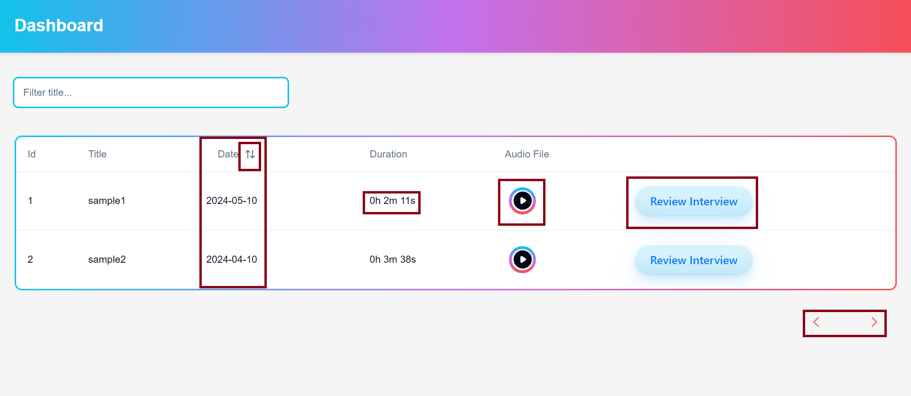
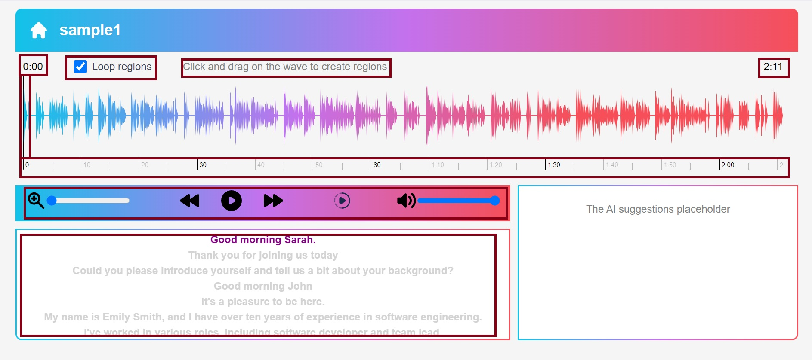
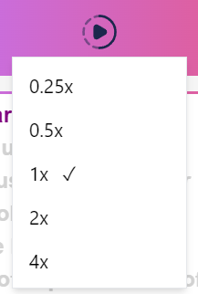

# Project X - Additional Documentation

## Introduction

This document provides detailed insights into the design and functionality of my project. It serves to highlight intricate details that might not be immediately apparent in the main documentation.

## UI/UX

- Leveraged Gestalt principles for intuitive interaction design.
- Clear feedback mechanisms for prompt user guidance.
- Thoughtful placement of navigational elements for easy exploration.
- Intuitive buttons and controls for seamless interaction.
- User-centric approach prioritizing clarity and consistency.

## Highlights

## Component Details

### `The Landing Page/Dashboard`

- **Header**:
  - The header features a gradient shade and a title called "Dashboard."
- **Search Bar**:
  - The search bar filters through the audio/recording titles.
- **Table**:
  - The table contains a list of recordings and their data.

#### `The Table`
- **Id, Title**
  - The recordings' IDs are unique. The Title represents the name of the interview audio.
- **Date**
  - The Date specifies the date of the interview. The Date column is sortable.
- **Duration**
  - The Duration column displays the total duration of the interview audio in 'h m s' format.
- **Audio File**
  - The audio file is styled to render in a circular shape with play and pause buttons toggling as required. There is also a progress bar around the icon showing the progress of the audio played.
- **Review Interview Button**
  - The Review button navigates to a new page where the user can work on individual interview recordings. The navigation is handled effectively to render the specific audio. The button also changes its styles to show appropriate feedback.
- **Pagination Buttons**
  - The pagination buttons are styled to give a minimalistic appearance and are enabled when there are more than 5 rows in the table.

### `Detailed Page/Review Interview Page`

#### `Header`

- **Home Icon**:
  - It also has a home icon which navigates to the home page. The home icon changes its color on hover to give appropriate user interaction feedback.
- **Title**:
  - The header features a gradient shade and displays the title of the audio.

#### `Audio Wave Visualization`
- **Timer**:
  - The timer is displayed at the top of the wave where the current playing time is at the top left and the total duration at the top right.
- **Loop Regions Checkbox**:
  - There is a checkbox which, when selected, plays the selected region in a loop. There is also a note on how to create regions because creating regions is not intuitive.
- **The Wave**:
  - The wave is displayed in a gradient color. The color changes for the played part of the audio. There is also a cursor displayed to show the current position of the audio played on the wave. Clicking anywhere on the wave starts the audio from that position.
- **Time Scale**:
  - Below the wave is a time scale to help users better understand the timing.

#### `Audio Controls`
- **Zoom**:
  - The zoom bar allows users to seamlessly zoom in and out of the wave visual of the audio. It uses a zoom icon instead of a label for a pleasant visual effect.
- **Play/Pause, Rewind, Forward**:  
  - The Play/Pause button toggles as required. It also is set back to pause state at the end of the audio. The forward icon helps advance the audio by five seconds, and the rewind icon helps rewind the audio by five seconds.
- **Playback Speed**:
  - This icon helps to set the playback speed of the audio. It functions as a visually appealing dropdown with appropriate feedback with a tick mark next to the current speed.
- **Volume**:
  - The volume bar allows users to seamlessly increase and decrease the volume.

#### `Transcription/Subtitles`

This section renders the subtitles of the audio file. The current line is highlighted with a purple color, making it easier for the user. The current section of the audio is also designed to be positioned at the center of the division.

#### `AI Suggestion/Feedback`

This section acts as a placeholder for AI-generated suggestions and feedback.

## Data Security

- File Access: 
    - The code uses the fs.readFileSync function to read the file. This function is a secure way to read files in Node.js because it doesn't allow for any external input to manipulate the file path. The file path is constructed using path.join, which ensures a valid file path.

- Data Parsing: 
    - The code parses the JSON data using JSON.parse. This is a safe operation as long as the JSON data is trusted. In this case, the data is read from a file in the server, so it should be trusted.

- Data Transmission: 
    - The data is sent over HTTP as a JSON response. If your server is set up to use HTTPS, this data will be encrypted in transit, which protects it from being intercepted by malicious parties.

#### Areas for Enhancement in Data Security and Privacy:

While the current implementation provides a robust foundation for secure and private data handling, there are several areas identified for future enhancements to strengthen the security measures and ensure compliance with best practices:

- Access Control Implementation:
  - Current State: The existing setup lacks authentication and authorization mechanisms, making the API accessible to any requester.
  - Enhancement Plan: Introduce authentication layers and authorization checks to restrict access to sensitive data, ensuring that only authorized users can interact with the API.

- Data Validation and Sanitization:
    - Current State: The JSON data parsed and transmitted by the server is assumed to be trusted without any explicit validation or sanitization.
    - Enhancement Plan: Implement rigorous data validation and sanitization processes to prevent potential data integrity issues or security vulnerabilities, particularly if client-side exposure could trigger exploitation.

- Optimization of Data Handling Processes:
    - Current State: Data is currently read entirely into memory, which could lead to performance bottlenecks or server instability with large files.
    - Enhancement Plan: Opt for data streaming techniques that handle large datasets more efficiently, reducing memory consumption and enhancing overall performance.

- Secure Data Transmission:
    -  Although data is transmitted securely over HTTP, enforcing HTTPS across all endpoints will guarantee encryption in transit and provide an additional layer of security.